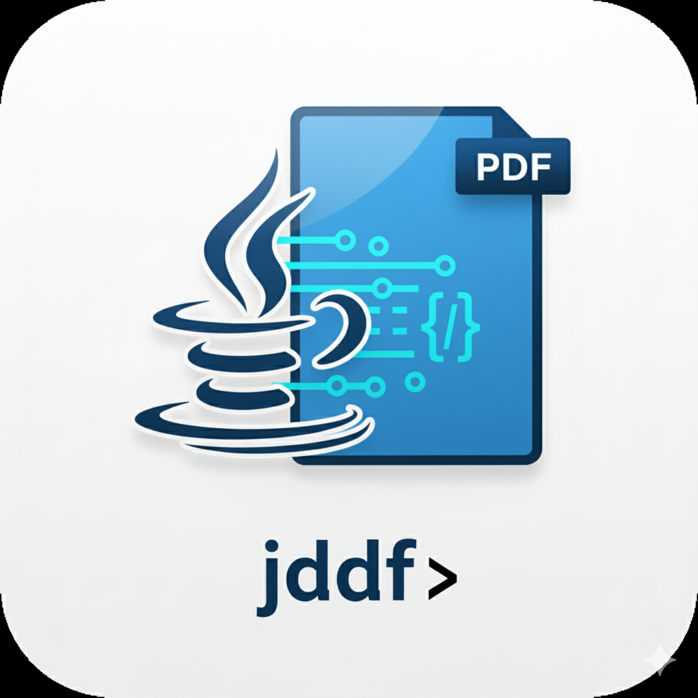

<p align="center">
  
</p>

# 🧩 JDDF — Java Document Dynamic Framework

**JDDF** A modular Java CLI for low-level PDF processing, enabling programmatic control over text, images, and structure, it is a Java-powered Swiss Army knife for PDF editing.

---

## 🚀 Features
- 🎨 **Text Color Manipulation** — Instantly recolor PDF text using RGB values, extract all the text and search for a term in   
- 🖼️ **Image to PDF Conversion** — Merge multiple images or directories into a single PDF, single image to pdf as well  
- 🧠 **Low-Level PDF Access** — Directly interact with PDFBox for fine-grained document editing  
- ⚙️ **Portable Executable** — Single shaded JAR (`jddf.jar`) that runs anywhere with Java  
- 🧰 **CLI Simplicity** — Modular subcommands with automatic help menus and argument validation which are intuitive 

---

## 💻 Example Usage

```bash
# Display available commands
jddf --help

# Change text color in a PDF
jddf text-color "input.pdf" 255 0 0 "output.pdf"

# Merge multiple images into a PDF
jddf merge-images "output.pdf" "img1.png" "img2.png" 

# Convert an entire directory of images into a single PDF
jddf dir-to-pdf "images/" "output.pdf"
